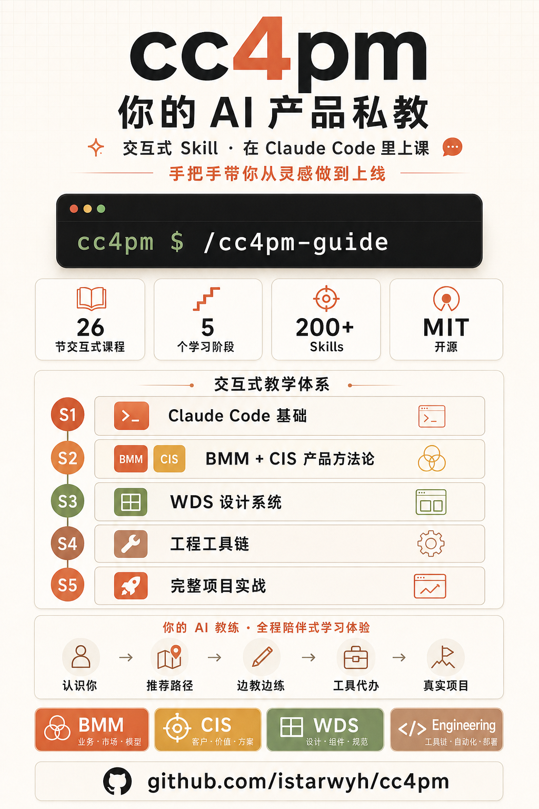

# cc4pm

**Claude Code for Product Makers** — AI 驱动的产品全生命周期系统

[](LICENSE)
[](https://github.com/istarwyh/cc4pm)

> 从想法到上线，一个人就是一支产品团队。

<div align="center">



**[🎨 Interactive Showcase](https://istarwyh.github.io/cc4pm/)** — 可视化了解四大核心模块、200+ Skills、完整产品工作流

</div>

---

## 这是什么

cc4pm 是一套面向**产品主理人**的 AI 全生命周期产品系统**交互式课件**。运行 `npx cc4pm install` 走交互式安装，然后在 Claude Code 里输入 `/cc4pm-guide` 即可开始学习。

课件覆盖四大主题，从灵感验证到产品上线发布的完整链路：

- **BMM**（业务建模）— 市场研究、PRD 创建、需求拆解、冲刺规划
- **CIS**（创意智能）— 36 种创意技巧、30 种创新框架、故事讲述
- **WDS**（设计系统）— 用户心理映射、UX 场景、设计规范、原型
- **工程工具链** — TDD、代码审查、E2E 测试、安全扫描、CI/CD

仓库里同时收录了课件讲解的**参考实现**（`.claude/` 下的 175 个 skill、9 个代理、37 个命令、45 条规则），可以与课件配合检阅，也可以独立 fork 使用。基于 [Everything Claude Code](https://github.com/affaan-m/everything-claude-code)（Anthropic 黑客马拉松获奖项目）构建。

---

## 快速开始

```bash
# 交互式安装（推荐）
npx cc4pm install

# 非交互（CI / 脚本）
npx cc4pm install --modules cc4pm-guide

# 看其他命令
npx cc4pm --help
```

安装完成后打开 Claude Code，输入 `/cc4pm-guide` 启动交互式教学。

也可以克隆仓库后直接使用（同时获得参考实现）：

```bash
git clone https://github.com/istarwyh/cc4pm.git
cd cc4pm && claude
```

默认安装目标是 Claude Code，内容会写入 `~/.claude/`：

- `skills/cc4pm-guide`
- `guide`
- `scripts/cc4pm-guide-qmd-check.js`
- `cc4pm/install-state.json`

### 核心命令速览

| 命令 | 用途 | 包含在课件安装中 |
|------|------|---|
| `/cc4pm-guide` | 交互式教学（5 阶段 26 节课） | ✅ |
| `/bmad-brainstorming` | 头脑风暴，36 种创意技巧 | 课件讲解，需 git clone 启用 |
| `/bmad-create-prd` | AI 辅助创建 PRD | 同上 |
| `/bmad-market-research` | 市场研究与竞争分析 | 同上 |
| `/bmad-sprint-planning` | 冲刺规划与进度追踪 | 同上 |
| `/plan` | 技术实现规划 | 同上 |
| `/tdd` | 测试驱动开发 | 同上 |
| `/code-review` | 代码质量审查 | 同上 |
| `/e2e` | 端到端测试 | 同上 |

> `npx cc4pm install` 只安装课件；想用 `/bmad-*`、`/plan`、`/tdd` 等命令需要 `git clone` 整个仓库到本地 `.claude/`。

---

## 四大核心模块

### BMM — 业务建模方法

端到端产品开发工作流。8 个角色代理（分析师、PM、架构师、开发者、QA、敏捷大师、UX 设计师、快速开发者），33 个工作流覆盖分析→规划→方案→实现全阶段。

**典型流程**：市场研究 → 产品简报 → PRD → 架构设计 → 需求拆解 → 冲刺规划 → 开发交付

### CIS — 创意智能战略

5 个创意代理（头脑风暴教练、创新战略家、设计思维教练、问题解决专家、故事讲述大师），36 种创意技巧分 7 大类，30 种创新框架。

**典型流程**：头脑风暴 100+ 想法 → 蓝海分析 → 商业模式设计 → 产品叙事

### WDS — Web 设计系统

从用户心理驱动产品设计。2 个设计代理（Saga 故事女神、Freya UX 设计师），8 阶段设计方法。

**核心能力**：Trigger Map（用户心理→功能映射）→ UX 场景 → 设计规范 → 原型 → 设计系统

### 工程工具链

18 个工程代理，48 个命令，46 条规则。

**核心能力**：/plan 规划 → /tdd 开发 → /e2e 测试 → /code-review 审查 → /build-fix 修复

---

## 产品全生命周期

一个创始人使用 cc4pm 从零到一的典型路径：

```
灵感 ─── CIS 头脑风暴 + 创意技巧
  │
验证 ─── BMM 市场研究 + 竞争分析
  │
设计 ─── WDS Trigger Map + UX 场景
  │
规划 ─── BMM PRD + 架构 + 冲刺规划
  │
开发 ─── /plan → /tdd → /code-review
  │
测试 ─── /e2e + 安全扫描
  │
上线 ─── 部署 + 产品叙事
```

---

## 交互式教学

cc4pm 内置了一套完整的交互式课程（26 节课，5 个阶段）：

```bash
# 启动教学
/cc4pm-guide
```

| 阶段 | 内容 | 时长 |
|------|------|------|
| 1. 基础入门 | Claude Code 核心能力、四大模块全景 | ~30 min |
| 2. 产品核心 | BMM + CIS，头脑风暴到冲刺规划 | ~30 min |
| 3. 设计与心理 | WDS，Trigger Map 到 UX 设计 | ~20 min |
| 4. 工程协作 | TDD、E2E、代码审查、质量门禁 | ~15 min |
| 5. 高级实战 | MCP 集成、完整项目从零到发布 | ~25 min |

---

## 项目结构

```
cc4pm/
├── guide/                  课件本体：5 阶段 × 26+ 节课 + course-map.yaml
├── .claude/
│   ├── skills/cc4pm-guide/   交互式教学入口（SKILL.md）
│   ├── skills/               175 个参考 skill（含 bmad-* / 工程 skill）
│   ├── agents/               9 个参考代理（planner / tdd-guide / code-reviewer 等）
│   ├── commands/             37 个参考斜杠命令
│   ├── rules/                45 条编码规则（通用 + 7 种语言）
│   ├── hooks/                事件驱动 hooks 配置
│   └── mcp-configs/          MCP 服务器配置
├── _bmad/                  BMAD METHOD V6 方法论源文档（BMM/CIS/WDS/Core）
├── manifests/              安装清单（cc4pm-guide 单模块）
├── scripts/                安装器（cc4pm.js / install-*.js）+ 课件同步脚本
├── docs/                   Showcase 站点
├── packages/homepage/      @cc4pm/homepage 独立子包
└── the-{long,short}form-guide.md   课件补充长/短文版
```

---

## 致谢

cc4pm 基于 [Everything Claude Code](https://github.com/affaan-m/everything-claude-code) 构建，感谢原作者 [Affaan Mustafa](https://x.com/affaanmustafa) 和所有贡献者。

---

## License

MIT
