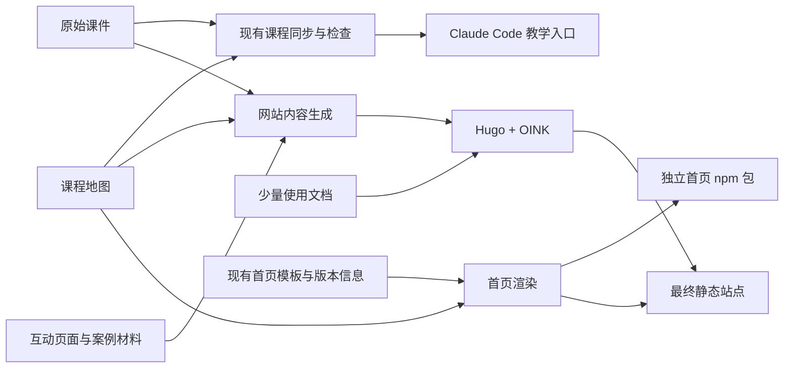

# cc4pm 网站建设方案：从现有课件发布官方文档

方案日期：2026-09-06。状态：本地实现与验证已完成，进入 Pages 发布流程；实现与维护入口见 [website/README.md](../website/README.md)，验收记录见 [website/validation.md](../website/validation.md)。本文件保留建设依据，实际命令以维护文档为准。

建设目标：让读者能在网站找到课程、完整阅读、体验已有互动页面，再进入 Claude Code 完成实操。课程作者继续维护原有课件，网站通过构建生成阅读版本。

## 1. 建设原则

1. `guide/` 和 `verticals/lawyer/guide/` 继续承载课程正文及课程地图。
2. 网站、首页课程区、Claude Code 教学入口使用同一份课程事实。网站不另写课程正文，不维护第二份课程目录。
3. 保留现有首页的视觉和独立 HTML 分发能力；课程列表、数量、版本等易变化的信息改为生成。
4. 阅读、搜索和互动演示在浏览器中完成；安装、调用 Skills 和项目实操在用户本机的 Claude Code 中完成。
5. 第一版完整发布现有课程。新增写作集中在安装说明、学习方式说明和少量索引页。

## 2. 已有内容及复用方式

以下数量来自当前工作区，发布时应重新计算。

| 已有资产 | 当前情况 | 网站处理方式 |
| --- | --- | --- |
| `guide/course-map.yaml` | 5 阶段，26 节主线、52 节补充 | 生成课程目录、顺序、编号、搜索关键词、课程统计 |
| `guide/lessons/stage-*/*.md` | 78 篇，全部可由课程地图定位 | 完整发布正文，构建时适配页面元数据和链接 |
| `verticals/lawyer/guide/course-map.yaml` 与课件 | 4 阶段，10 节课 | 使用同一生成流程，独立课程入口与侧栏 |
| `guide/lessons/stage-*/*.html` | 12 个文件，其中 1 个为微信专用变体 | 11 个普通互动/概览页面作为配套资源；微信变体保留在源目录 |
| `guide/lessons/assets/base.css` | 11 个普通 HTML 页面均引用 | 保持与 HTML 的相对目录关系，原样发布 |
| `guide/lessons/shared/practice-notice.md` | 多节课程引用的实操须知 | 发布为共享阅读页，所有引用指向同一个页面 |
| 律师课程 `templates/` | 9 个 Markdown 文件 | 从原文件生成模板说明/源码入口，提供原始文件下载 |
| 律师模拟案例与 `expected-outputs/` | 合计 19 个 Markdown 文件 | 生成案例材料与参考交付件入口，保留“教学模拟”的原始说明 |
| `docs/index.html` | 现有完整首页 | 复用布局、文案主体、视频、安装区和设计风格 |
| `packages/homepage/` | 对外发布的独立首页包 | 保留 `filePath`、`html()` 接口和单文件 HTML 交付 |
| `docs/showcase-design-spec.md` | 已有视觉规范 | 作为文档页面品牌适配依据 |
| 安装清单、CLI、README | 安装方式和产品说明的依据 | 编写简短使用文档；命令、模块状态以代码和清单为准 |

产品主线的实际分布如下：

| 阶段 | 主线 | 补充 | 合计 |
| --- | ---: | ---: | ---: |
| Claude Code 基础入门 | 10 | 13 | 23 |
| 产品主理人核心能力 | 6 | 3 | 9 |
| 网页设计系统 | 4 | 12 | 16 |
| 工程工具链 | 3 | 15 | 18 |
| 高级应用与持续优化 | 3 | 9 | 12 |
| 合计 | 26 | 52 | 78 |

当前主线课件中，78 篇均有“下一步”，73 篇有“本课目标”，69 篇有“常见问题”。这些内容已能构成完整阅读页，无需先重写为另一套教程。

## 3. 网站结构与读者路径

一级导航建议为：首页、课程、使用文档、GitHub。课程区同时展示产品主线和标记为 Beta 的律师课程。

下面的路径均相对于网站 baseURL，不代表已经配置新的域名。

| 路径 | 读者要完成的事 | 内容来源 |
| --- | --- | --- |
| `/` | 了解项目并选择开始方式 | 现有首页，加上生成的课程摘要与阅读入口 |
| `/courses/` | 选择课程 | 两份课程地图及各自简介 |
| `/courses/product/` | 浏览 5 阶段课程，找到主线或补充课 | 产品课程地图 |
| `/courses/product/stage-1/lesson-1/` | 阅读一节完整课程 | 对应 lesson Markdown |
| `/courses/lawyer/` | 了解课程定位、案例和学习顺序 | 律师 README、课程地图 |
| `/courses/lawyer/stage-1/lesson-1/` | 阅读律师课程 | 对应 lesson Markdown |
| `/courses/lawyer/materials/` | 查看案例、模板、参考交付件 | 对应原文件，明确区分材料与参考输出 |
| `/docs/start/` | 安装并启动第一堂课 | 当前 CLI、安装清单及 README |
| `/docs/learning/` | 理解网页阅读与 Claude Code 带练如何配合 | 教学入口中面向学习者的使用方式 |
| `/docs/installation/` | 查看模块选择、安装位置、诊断、修复、卸载 | CLI 实现与模块清单 |
| `/docs/modules/` | 区分已安装课件与仓库参考工具 | 模块清单，链接相关课程讲解 |
| `/docs/practice/` | 了解实操 session 的使用方式 | `shared/practice-notice.md`，只生成一个正文页面 |
| `/docs/faq/` | 解决安装和学习方式问题 | 项目级 FAQ，知识点问题继续留在对应课件中 |
| `/docs/contributing/` | 修改课件、预览并提交 | 面向贡献者的简短维护说明 |

三个优先走通的路径：

1. 新读者：进入首页 → 看课程地图 → 阅读第一课 → 打开互动全景 → 查看安装步骤 → 在 Claude Code 输入 `/cc4pm-guide`。
2. 按需查阅者：搜索“上下文 / CLAUDE.md / MCP”等词 → 进入对应课程 → 阅读练习并复制提示词 → 在本机执行 → 回到课程继续阅读。
3. 行业学习者：进入律师课程 → 阅读课程定位 → 查看模拟案例 → 获取模板与材料 → 输入 `/cc4lawyer-guide` 开始带练。

## 4. 课程阅读页

阅读页采用 OINK Book 布局：左侧按阶段排列课程，中间显示正文，右侧显示页内目录。每个课程根配置独立侧栏，防止产品课、律师课和使用文档混在一起。

页面呈现顺序为：课程与阶段位置 → 编号、标题、主线/补充标记 → 原有学习目标及正文 → 原有练习与 FAQ → 原有“下一步” → 网站前后课导航。

配套提供三个轻量入口：打开互动演示、复制本课学习提示、查看/编辑课件源文件。没有互动资源的课程不显示空按钮。

“在 Claude Code 中学习”展示安装/启动说明和可复制的自然语言提示，例如“请带我学习 Lesson 17.10：UI 设计风格词典与选择方法”。不把它包装为已存在的远程启动或进度同步能力。

课程目录以原地图顺序展示全部课程，补充课有明确标记。课程首页可以提供“只看主线”的筛选，但默认前后课导航始终遵循原课程地图；第一版不引入第二套学习顺序。

律师课中的“讲课提示”“参考交付物”和课程适用边界保留。参考输出通过明确入口打开，不混入原始案例材料列表。

## 5. 内容生成规则

### 5.1 元数据以课程地图为准

生成器读取地图和课件，生成 Hugo 页面所需的 front matter。映射规则如下：

| 源字段 | 网站用途 |
| --- | --- |
| 课程标识 + `stage.id` + `lesson.id` | 页面稳定身份、来源映射及路由；`lesson.id` 单独并不全局唯一 |
| `file` | 读取课件，作为相对链接解析的起点 |
| `title` | 页面标题 |
| `short_title` | 侧栏短标题，缺失时使用 `title` |
| `number` | 显示编号，作为字符串保留，例如 `17.10` |
| 阶段与课程在 YAML 中的位置 | Hugo `weight` 与阅读顺序 |
| `supplementary` | 补充课标记，缺失时为主线 |
| `topics` | `search_keywords`，缺失时不强求补齐 |
| 来源文件路径 | 编辑链接、源码入口、内容更新时间 |

不同阶段可能复用 `lesson-1`，文件名也不等于全局课号。例：`guide/lessons/stage-3/lesson-1.10.md` 显示 Lesson 17.10，不能通过文件名推断为 Lesson 1.10。

不按文件名字典序或浮点数排序。`17.10` 已在源地图中使用字符串，生成后必须完整保留。路由由课程、阶段、lesson ID 显式生成，例如 `/courses/product/stage-3/lesson-1.10/`。

主线有 5 篇课件已带 front matter。解析时保留来源元数据，地图掌握课程身份、标题、编号和顺序；网站只输出受控的 Hugo 字段。重复字段不一致时应报告，不能悄悄覆盖后掩盖差异。

### 5.2 正文只做机械适配

保留讲解、示例、提示词、代码、练习、FAQ、前置知识及参考资料。允许的转换限定为：

1. 解析既有 front matter，生成网站元数据。
2. 去掉与页面标题重复的开头一级标题，保留其余标题及可用锚点。
3. 去掉末尾由 `sync-courseware.js` 生成的“阶段 / 上一课 / 下一课”单行页脚，使用网站导航替代；正文中的“下一步”章节继续保留。
4. 将真实 Markdown 链接解析到课程页面、共享页面、互动资源或明确的源码地址。
5. 对既有 HTML 内容、长代码和表格做渲染验证。

使用 Markdown 语法树或保留源位置的解析器定位转换范围，保持代码块和提示词内容。不能全局替换 `.md`，也不能把代码示例中的本地路径改为网址。保留并验证链接中的 query 和 fragment；标题处理影响锚点时补上明确锚点。

不在构建时调用模型改写、摘要或翻译课件。需要润色时修改源课件，使终端教学与网站一起受益。

### 5.3 资源按原目录发布

普通互动页面与 CSS 发布到如下结构：

```text
public/interactive/product/
  assets/base.css
  stage-1/lesson-1-panorama.html
  stage-1/lesson-5-directory-guide.html
  stage-2/stage2-overview.html
  ...
```

这样 HTML 中的 `../assets/base.css` 继续有效。课堂正文中的互动链接由来源映射改为对应网址。默认打开独立页面，避免把整份 HTML、全局 CSS 和脚本内联进 OINK 正文。

用课件里已有的链接确定关联；未被 Markdown 链接发现的 `lesson-5-directory-guide.html` 和阶段概览，在对应源课程地图上补充可选资源关联。资源关联只记录路径和用途，不复制课程标题、目录或正文。

`.wechat.html` 是已有内容的特定渠道变体，第一版不作为独立课程或搜索结果发布。其余站点生成物同样使用明确的来源范围，避免把整个仓库复制到公开站点。

Lesson 24.8 的六张正文图片目前使用外部 OSS URL。第一版保留并验证这些引用，不宣称课件整体已具备离线资源能力。

律师模板和案例可从原目录生成阅读页及原始文件下载。下载文件保留原内容、文件名和必要目录关系，方便本地实操。脚手架中的 `CLAUDE.md`、Skill 和 Agent 模板以教学材料身份展示，不能直接当成网站正文执行。

### 5.4 搜索与 Agent 阅读

第一版启用中文全文搜索，覆盖课程正文和使用文档。复用 `topics`，再按实际搜索失败补充少量中文同义词；当前有 599 个不同 topic，不直接生成 599 个标签页。

生成每页 Markdown、`llms.txt` 和 `navigation.json`，让 Agent 可以查到同一份课程。复制 Markdown 时也要带上可解析的课程/资源链接。

OINK 的 `LLMSFULL` 仅支持顶层 section。当前设计中两个课程位于 `/courses/` 下，因此后续若启用全文包，应先用 `/courses/llms-full.txt`；不能默认宣称已有每门课程独立全文包。

网站使用静态搜索，终端教练可以继续使用 QMD。两者复用内容，不需要在网站部署 QMD 服务。

## 6. 首页与网站的衔接

现有首页已经有完整表达，保留其米白底色、陶土橙强调色、模块配色、视频、能力说明和安装区。文档页按阅读密度调整布局，品牌适配通过 OINK 的配置和项目级 SCSS 完成。

首页新增“阅读课程”“使用文档”入口，课程条目变为可点击链接。课程数量、阶段列表、课名、课号和项目版本使用同一份课程数据与 `package.json` 生成。

实施时为 `docs/index.html` 中需要生成的课程区/统计区设定明确边界。构建读取这个页面作为首页模板，只替换这些区域和受控的站点链接，其余作者维护的 HTML 保持原样。生成过程不回写课件。

同一个首页渲染步骤产出网站的 `index.html` 和 `packages/homepage/index.html`，确保两处内容一致。现有 `build:homepage` 的直接复制、发布工作流中的直接比对，以及发布脚本中的版本替换，需要一起调整到这条链路。

首页包仍为可独立使用的单文件 HTML；不能要求下游再加载网站的课程 JSON 才能展示目录。文档和课程链接使用配置中的正式绝对 URL，避免嵌入 `ai-speeds` 后相对路径指向错误位置。

## 7. 仓库与构建组织

建议新增以下目录；它只承载网站专用内容与发布转换。

```text
website/
  hugo.yaml                  # 中文、导航、搜索、主题、输出格式
  go.mod / go.sum             # 固定 OINK 版本
  site.yaml                  # 课程来源注册、正式链接、发布资源范围
  content/docs/              # 少量手写使用文档
  assets/scss/               # 项目颜色和阅读样式
  layouts/                   # 必要的课程页功能与来源链接覆盖
  scripts/                   # 内容准备、首页渲染、校验、预览入口
  .generated/                # 生成的课程、材料、首页和静态资源，不提交
  public/                    # 最终部署产物，不提交
```

`site.yaml` 只登记两门课程的位置和网站需要的补充配置，不能把两份课程地图再抄一遍。Hugo 同时挂载手写内容与生成内容；相同路径冲突时构建失败。



构建顺序：检查课程地图和原有同步状态 → 生成课程/资源与来源映射 → 渲染首页 → Hugo 严格构建 → 以渲染后的首页组装站点根页面 → 校验最终路径、链接、资源和输出。

原有课件同步脚本继续负责终端教学产物，网站生成器负责读取与发布，不把 Hugo 变成安装 CLI 的运行依赖。网站需要的 Markdown/YAML 解析依赖声明为构建依赖并固定 lockfile，不能依赖偶然存在的传递依赖。

开发预览必须监听原始 `guide/`、律师课件、课程地图及互动资源。修改原课件后重新生成并触发 Hugo 刷新；只监听 `.generated/` 会造成预览不更新。准备过程只清理自身生成目录，以免遗留已删除的课件页面。

## 8. 部署与现有发布链路

第一版沿用 GitHub Pages。按仓库现有链接使用 `https://istarwyh.github.io/cc4pm/` 作为默认部署基址，部署工作流再从 Pages 配置取得实际 baseURL。新域名和 DNS 不在当前方案中假定已存在。

更新当前 `.github/workflows/pages.yml`，把触发范围扩展到课件、课程地图、互动资源、网站目录、首页模板、版本及构建依赖配置。上传 `website/public/` 最终产物，替代直接上传整个 `docs/`。

保持一个 Pages 部署入口，避免新旧工作流交替发布不同内容。部署阶段验证工作流结果和真实公开网址，尤其是 `/cc4pm/` 子路径。

更新 `publish-homepage.yml`，使课程地图或首页渲染规则变化也能检查首页产物。沿用 npm 包版本和下游更新机制；“生成内容变化”不能被误报为“同版本已成功发布”。

检查 `scripts/release.sh`，让版本更新、首页生成、包内容检查使用同一套数据。网站源码、缓存和 `public/` 不进入 `cc4pm` 安装包，用户安装课程也不需要 Hugo 或 Go。

## 9. 分阶段实施与验收

### 第一阶段：验证一条完整发布路径

搭建 OINK 最小中文站与内容生成器，选取四类课件验证：无 front matter 的第一课、带 front matter 的 Lesson 24.1、编号为字符串的 Lesson 17.10，以及一节律师课。再加入共享实操须知、全景互动页和 CSS。

验收：源课件不被构建修改；正文、代码、编号正确；两门课程侧栏独立；相对链接与互动页面可访问；原始源码编辑链接正确；中文搜索及 Markdown 输出可用。

### 第二阶段：形成完整可预览网站

通过同一生成器发布全部 88 节课、11 个普通互动页面、共享须知及律师案例/模板；补齐简短使用文档，接入现有首页及自动课程摘要，统一品牌样式。

验收：每节课都有唯一可访问地址；网站目录和原课程地图逐项一致；正文与源课件只存在约定转换差异；已删除源页不会残留；新增课件无需修改第二份导航。

### 第三阶段：发布并验证交付链路

更新 Pages、首页包及发布脚本，完成公开部署和下游首页链接检查。

验收包括：

- 首页 → 第一课 → 互动页面 → 返回课程 → 下一课完整走通。
- 搜索“上下文”“CLAUDE.md”“MCP”“17.10”能找到预期课件。
- 律师课程 → 模拟材料 → 模板原文件 → 安装说明完整走通。
- 移动端目录、长表格、代码块、明暗主题和键盘操作可用。
- Markdown 输出、`llms.txt`、导航 JSON、canonical 和 404 符合部署地址。
- 修改源课程标题后，课程页、课程目录、首页摘要和首页包同步变化。
- `npm test`、网站来源与链接检查、Hugo 严格构建通过；仅对转换边界和真实故障风险补充针对性测试。
- 首页包 API 可用，最终 npm 包不包含网站缓存/产物，终端课程安装流程仍正常。

先完成这三阶段。博客、登录、跨设备学习进度、在线 AI 教练、全量工具百科和知识图谱作为后续需求评估，不作为发布现有课件的前置条件。

## 10. 已发现的具体问题与验证边界

| 发现 | 建设时处理 |
| --- | --- |
| 首页将 24.1 写为 LLM Wiki，当前地图的 24.1 是 MCP 生态；阶段统计也有滞后 | 用课程地图生成首页摘要与目录 |
| 首页显示 v1.8.3，根包为 v2.0.6 | 所有项目版本展示从根包生成，首页子包版本独立管理 |
| Lesson 5 两处链接使用 `../../../../../CLAUDE.md`，从当前目录解析会越出仓库，目标不存在 | 修正源课件引用并核对其对文件内容的描述；构建遇到越界/缺失目标直接报告 |
| 78 篇产品课件中只有 5 篇有 front matter，律师课件均没有 | 统一从课程地图生成网站元数据，兼容既有 front matter |
| 律师课程地图缺少 `short_title`、`topics` 等产品地图字段 | 明确缺省规则，不要求重写课程地图 |
| 互动页包含一个微信变体，部分正常页面未建立课程链接 | 明确发布范围，补充最少资源关联 |
| `guide/_resources/understanding-map.md` 中的版本、目录、统计与现状不一致 | 用作历史研究材料，不自动发布为官方说明 |
| 当前源码目录 `docs/` 同时存放首页与内部设计文档 | 仅发布选定的生成内容，不再整目录上传 |

本轮已通过 `node scripts/sync-courseware.js --check`，地图中的 88 个课程文件均存在。同步检查仍提示部分课件超过建议行数，这不等于网站不可发布；应先用页内目录和可读排版承载。

实施已完成全量生成、严格构建、站内链接检查、源文件保护测试和关键浏览器路径验证。GitHub Actions 配置及首页包发布检查已更新；Pages 部署独立执行，npm 正式发布与下游通知通过手动工作流执行。外部图片和视频沿用原地址，不纳入站内链接通过的结论。具体检查范围见验收记录。

## 11. 依据

- 项目：`guide/course-map.yaml`、`guide/lessons/`、`verticals/lawyer/guide/`、`scripts/sync-courseware.js`。
- 首页与发布：`docs/index.html`、`docs/showcase-design-spec.md`、`packages/homepage/`、`.github/workflows/pages.yml`、`.github/workflows/publish-homepage.yml`、`scripts/release.sh`。
- [OINK Starter](https://oink.pgsty.com/docs/start/starter/)：固定版本、配置和部署起点。
- [OINK Book](https://oink.pgsty.com/docs/write/book/)：阅读布局、显示编号和章节输出。
- [内容组织](https://oink.pgsty.com/docs/write/organize/)：`weight`、页面类型和独立侧栏。
- [品牌定制](https://oink.pgsty.com/docs/customize/brand/)：项目级 SCSS 与配色入口。
- [中文搜索](https://oink.pgsty.com/docs/customize/search/)：子串匹配及 `search_keywords`。
- [Agent 阅读输出](https://oink.pgsty.com/docs/customize/agents/)：Markdown、LLMS、NAVJSON 与全文包边界。
